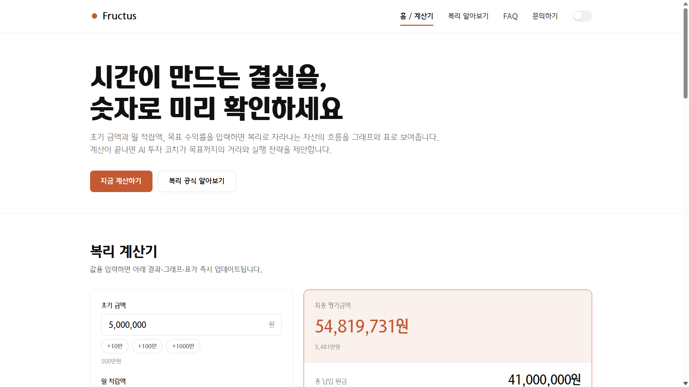
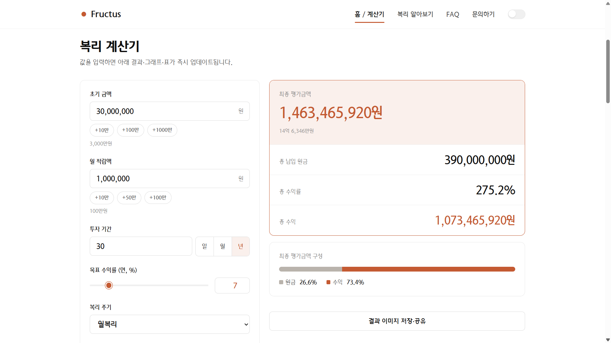
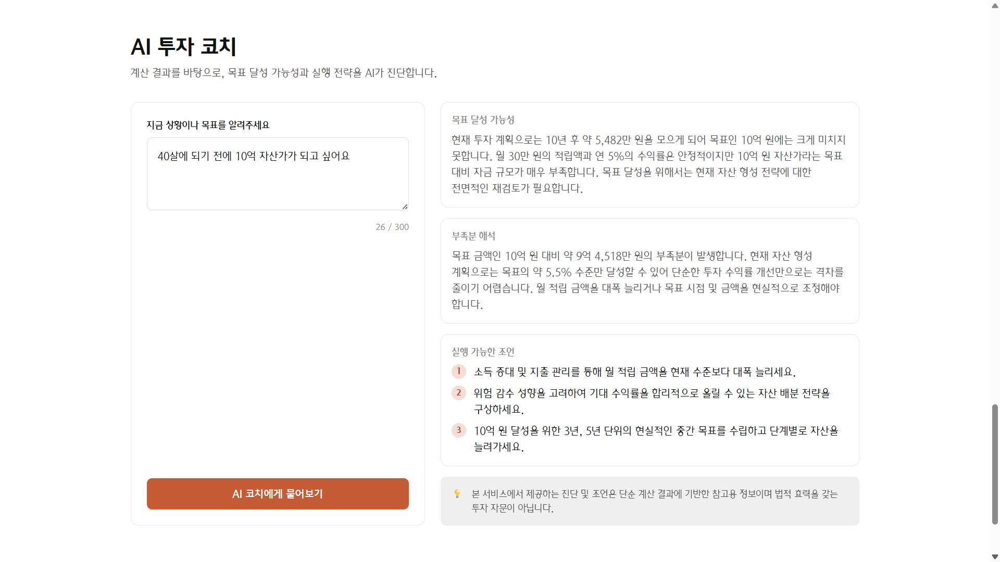
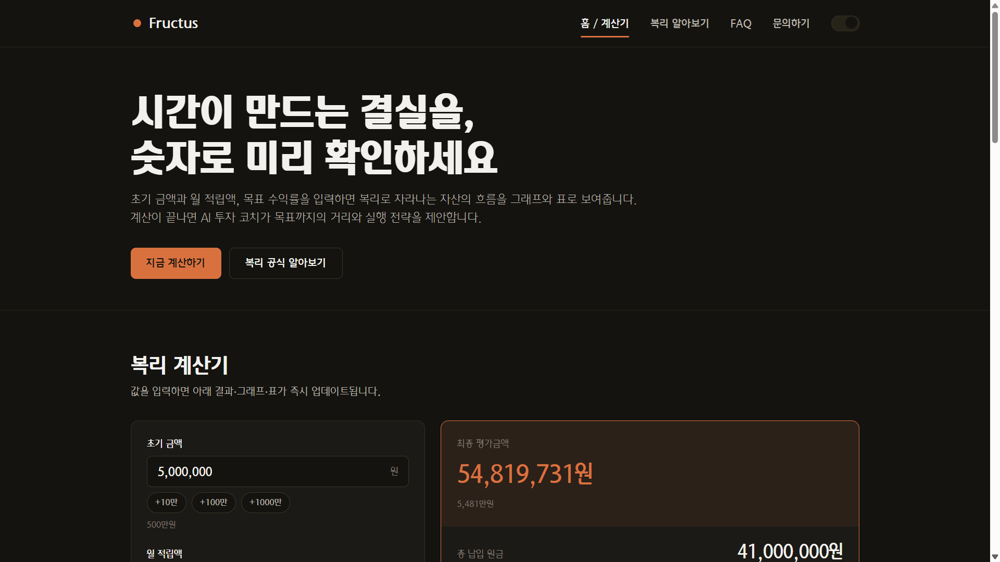
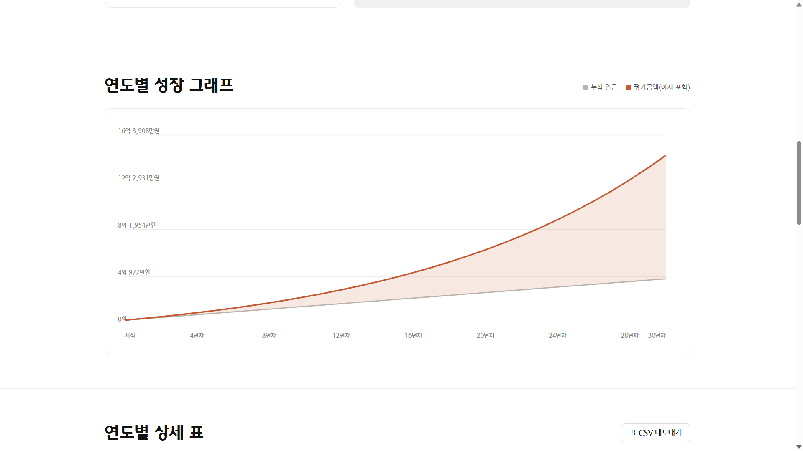
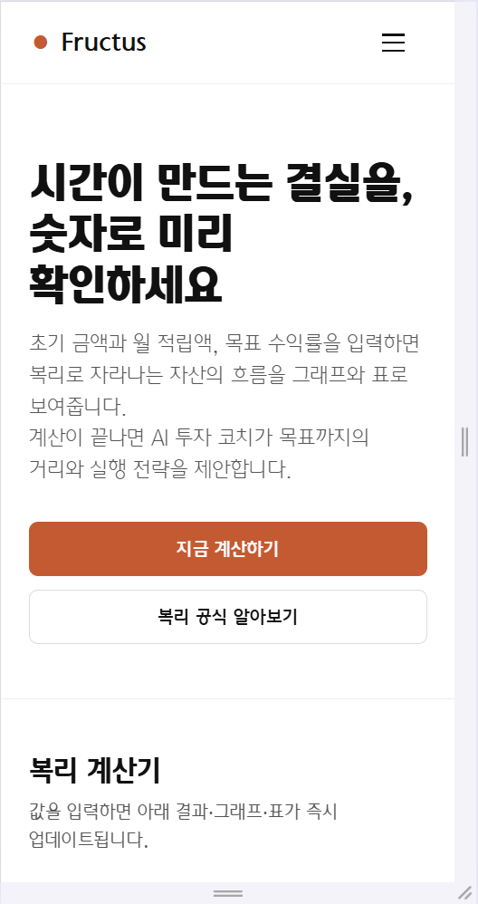
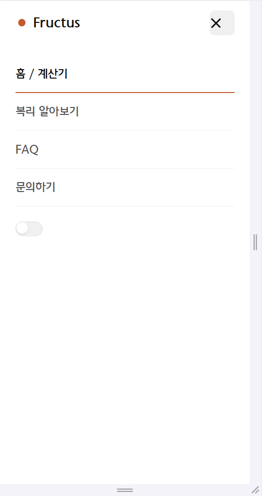
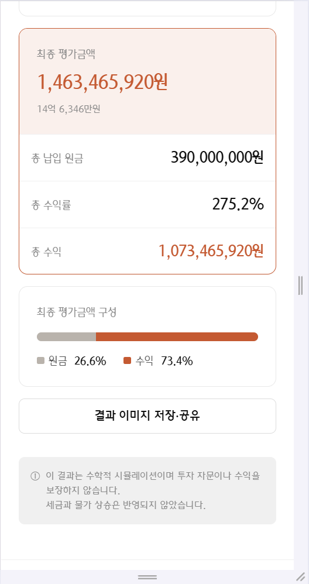
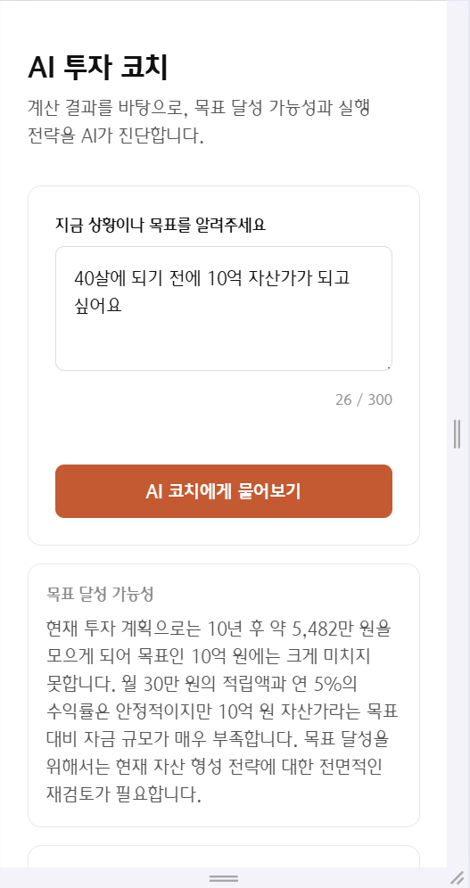

# Fructus — 복리 계산기

초기 금액·월 적립액·목표 수익률을 입력하면 복리로 자라나는 자산을 그래프·표로 보여주고, AI 투자 코치가 목표 달성 전략을 제안하는 복리 계산 웹 서비스입니다.

**배포 URL**: <https://codyssey-a1-3-alpha.vercel.app/>

## 핵심 기능

- 초기금액/월적립액/투자기간(일·월·년)/목표수익률/복리주기(연·월·일) 입력 및 실시간 검증
- 결과 요약(최종 평가금액 강조 + 4개 지표, 카운트업 애니메이션) + 순수 SVG 연도별 성장 그래프(원금 vs 평가금액)
- 연도별 상세 표, CSV 내보내기, URL 쿼리스트링 및 결과 이미지(PNG) 저장·공유
- **AI 투자 코치**: 계산 결과 + 목표 문장을 분석해 달성 가능성·부족분·실행 조언 3가지 제공
- 빈 입력 / API 오류 / 타임아웃 3종 실패 처리 및 재시도
- 다크 모드, 마이크로 인터랙션, 문의 폼 → Discord 웹훅 연동(보너스)

## 화면 미리보기

<table>
  <tr>
    <td width="50%"></td>
    <td width="50%"></td>
  </tr>
  <tr>
    <td align="center"><b>홈 — 데스크톱</b></td>
    <td align="center"><b>복리 계산 결과</b></td>
  </tr>
  <tr>
    <td></td>
    <td></td>
  </tr>
  <tr>
    <td align="center"><b>AI 투자 코치 (실제 응답)</b></td>
    <td align="center"><b>다크 모드</b></td>
  </tr>
</table>


<p align="center"><b>연도별 성장 그래프 — 외부 라이브러리 없이 순수 SVG로 구현</b></p>

<p align="center">
  
  
  
  
</p>
<p align="center"><b>모바일 반응형 — 홈 / 메뉴 / 계산 결과 / AI 코치</b></p>

> 전체 증빙 스크린샷 14종은 [docs/SCREENSHOTS.md](docs/SCREENSHOTS.md)에서 확인할 수 있습니다.

## 기술 스택

| 영역 | 스택 |
|---|---|
| 프론트엔드 | 순수 HTML / CSS / JavaScript (프레임워크·차트 라이브러리 미사용) |
| 타이포그래피 | Hana2 웹폰트 자체 호스팅(WOFF2, 6종 굵기 + 숫자 전용 CM 컷) |
| 백엔드 | Vercel Serverless Functions (Python, `BaseHTTPRequestHandler`) |
| AI API | Google Gemini API (`gemini-3.6-flash`) |
| 자동화 | Discord Webhook (문의 알림) |
| 배포 | Vercel + Vercel Web Analytics |

## 프로젝트 구조

```
A1-3/
├─ index.html / learn.html / faq.html / contact.html
├─ css/        # 디자인 토큰, 레이아웃, 컴포넌트, 애니메이션, 폰트
├─ fonts/      # Hana2 웹폰트(WOFF2, 자체 호스팅)
├─ js/         # calculator / chart / ui / ai / share / nav / theme / faq / contact / analytics
├─ api/        # coach.py(AI 코치), contact.py(문의 웹훅)
├─ docs/       # 기획서·아키텍처·계산공식·테스트·보너스·학습·AI사용로그 문서
├─ requirements.txt
└─ vercel.json
```

## 환경 변수

| 변수 | 필수 | 설명 |
|---|---|---|
| `GEMINI_API_KEY` | 필수 | Google AI Studio에서 발급한 Gemini API 키 |
| `DISCORD_WEBHOOK_URL` | 선택 | 문의 알림용 Discord 웹훅 URL (미설정 시 접수는 성공, 알림만 생략) |

`.env.example`을 복사해 `.env`를 만들고 값을 채웁니다(`.env`는 `.gitignore`에 포함되어 커밋되지 않음).

```bash
GEMINI_API_KEY=your_gemini_api_key_here
DISCORD_WEBHOOK_URL=your_discord_webhook_url_here
```

## 로컬 실행

```bash
git clone https://github.com/PSHUN03/Codyssey-A1-3.git
cd Codyssey-A1-3
python -m http.server 5500   # 프론트엔드 정적 서버 (api/*.py는 로컬 미동작, 배포 후 확인)
# 브라우저에서 http://localhost:5500/index.html 접속
```

## 배포 (요약)

1. `git push`로 GitHub(`PSHUN03/Codyssey-A1-3`)에 코드 반영
2. Vercel에서 해당 저장소 Import
3. Settings → Environment Variables에 위 환경 변수 등록
4. Deploy(또는 Redeploy) 실행 후 배포 URL에서 기능 확인
5. 코드 수정 시 `git push`만 하면 Vercel이 자동 재배포

## 상세 문서

- [서비스 기획서](docs/PLANNING.md)
- [아키텍처 / 데이터 흐름](docs/ARCHITECTURE.md)
- [복리 계산 공식 및 검증](docs/CALCULATION.md)
- [테스트 결과](docs/TESTING.md)
- [보너스 과제 설계](docs/BONUS.md)
- [학습 목표 정리](docs/LEARNING.md)
- [AI 코딩 도구 사용 로그](docs/AI_USAGE_LOG.md)
- [증빙 스크린샷 전체](docs/SCREENSHOTS.md)
