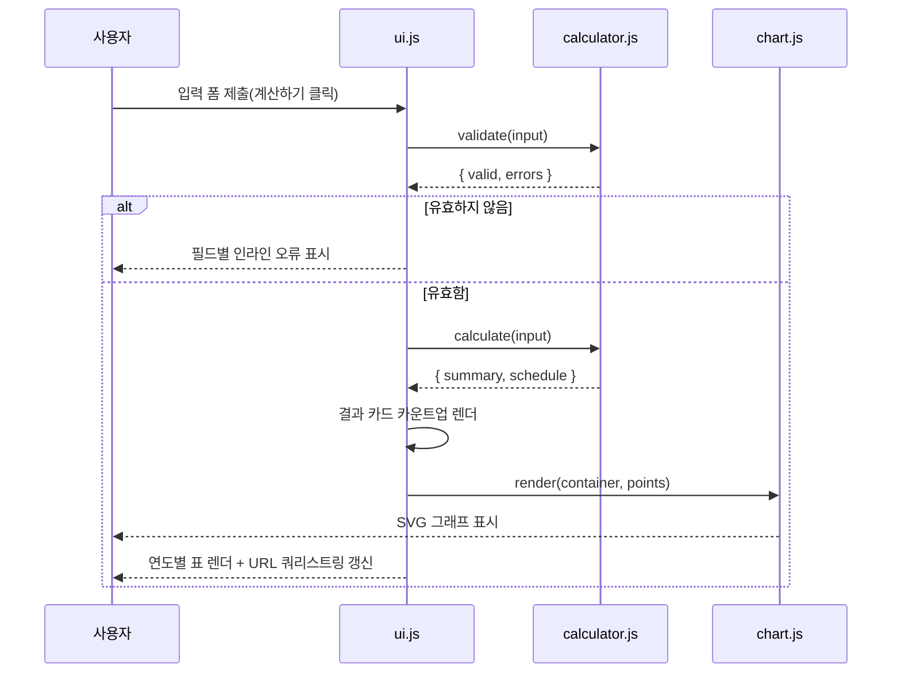
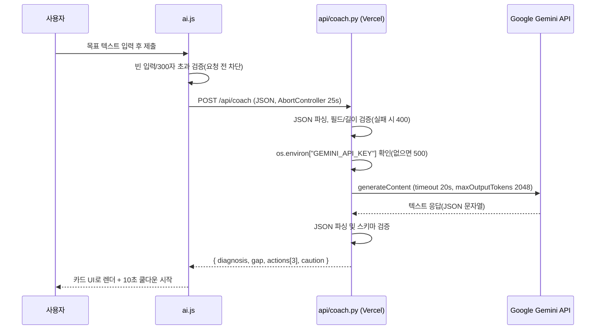

# 아키텍처

## 1. 폴더 구조

```
A1-3/
├─ index.html            # 홈 / 계산기
├─ learn.html             # 복리 알아보기
├─ faq.html                # FAQ
├─ contact.html            # 문의하기
├─ css/
│  ├─ reset.css            # 최소 브라우저 리셋
│  ├─ fonts.css             # Hana2 자체 호스팅 웹폰트 @font-face 등록
│  ├─ variables.css        # 디자인 토큰(색/타이포/스페이싱), 라이트+다크 팔레트
│  ├─ base.css              # 전역 타이포그래피, 컨테이너, 포커스 스타일
│  ├─ layout.css            # 헤더/네비게이션/푸터/12-col 그리드
│  ├─ components.css        # 버튼/입력/카드/아코디언/툴팁/스켈레톤 등
│  ├─ animations.css        # 키프레임, prefers-reduced-motion 처리
│  └─ pages.css              # 페이지별(hero/계산기/그래프/표/AI코치/learn/faq) 스타일
├─ js/
│  ├─ format.js              # 숫자 포맷(콤마, 억/만원, 파싱) 유틸
│  ├─ calculator.js          # 복리 계산 로직 + 입력 검증 (순수 함수)
│  ├─ chart.js                # SVG 영역 차트 렌더링
│  ├─ ui.js                   # index.html 폼↔결과↔그래프↔표 오케스트레이션
│  ├─ ai.js                   # AI 투자 코치 fetch 및 3종 실패 처리
│  ├─ share.js                 # 결과를 Canvas로 그려 PNG 저장/Web Share API 공유
│  ├─ nav.js                  # 모바일 메뉴, 활성 링크 표시
│  ├─ theme.js                # 다크모드 토글(저장은 인라인 스크립트가 선행)
│  ├─ faq.js                  # 아코디언 개폐, 검색 필터
│  ├─ contact.js              # 문의 폼 검증 및 제출
│  └─ analytics.js            # 자체 사용량 카운터(계산/AI코치/문의 실행 수)
├─ api/
│  ├─ coach.py                # AI 투자 코치 엔드포인트 (Gemini 호출)
│  └─ contact.py              # 문의 접수 엔드포인트 (Discord 웹훅)
├─ images/                    # 정적 이미지(파비콘 등, 현재 없음 — data URI 사용)
├─ fonts/                     # Hana2 웹폰트(WOFF2, 자체 호스팅)
├─ docs/                      # 문서 (본 파일 포함)
├─ requirements.txt           # Python 의존성 (requests)
└─ vercel.json                 # Serverless Function maxDuration 설정
```

## 2. 데이터 흐름

### 2-1. 복리 계산 (서버 호출 없음)



### 2-2. AI 투자 코치 (Serverless Function 호출)



## 3. 프론트 → 백엔드 호출 규약

- 프론트는 `fetch('/api/coach', { method: 'POST', body: JSON.stringify(...) })` 로만 백엔드를 호출한다. 별도 API 베이스 URL이 없는 이유는 Vercel이 `api/*.py`를 동일 도메인의 `/api/*` 경로로 자동 라우팅하기 때문이다.
- 각 Python 파일은 `BaseHTTPRequestHandler`를 상속한 `handler` 클래스를 export해야 하는 Vercel Python 런타임 규격을 따른다.
- 응답은 항상 `application/json`이며, 성공/실패 모두 JSON 바디를 갖는다(에러도 `{ "error": "..." }` 형태로 통일).

## 4. 과금·쿼터 방어 정책 (AI 기능)

| 계층 | 정책 |
|---|---|
| 클라이언트 | 목표 텍스트 300자 제한, 요청 완료 후 10초 쿨다운, 25초 타임아웃(AbortController) |
| 서버 | 요청 본문 8,000바이트 초과 시 400, 목표 텍스트 300자 재검증, Gemini `maxOutputTokens=4096` 상한, 외부 호출 30초 타임아웃 |
| 배포 설정 | `vercel.json`의 `api/coach.py` `maxDuration: 50`(서버 30s < 클라이언트 38s < 함수 50s 순서 보장), `api/contact.py`는 `maxDuration: 15`(웹훅 호출 10s 기준) |

## 5. 보안 원칙

- API 키(`GEMINI_API_KEY`, `DISCORD_WEBHOOK_URL`)는 Vercel 환경 변수로만 관리하며 코드에 하드코딩하지 않는다.
- `api/coach.py`, `api/contact.py`는 `log_message()`를 오버라이드해 기본 접근 로그(요청 경로 등)를 남기지 않도록 최소화했고, 예외 메시지에 키 값이나 트레이스백을 절대 포함하지 않는다.
- `.env`는 `.gitignore`에 포함되며 `.env.example`만 저장소에 커밋한다.
- Gemini 호출 시 키는 URL 쿼리스트링(`?key=`)이 아니라 `x-goog-api-key` 헤더로 보낸다.
  URL에 담으면 프록시·접근 로그·리퍼러에 키가 그대로 남을 수 있기 때문이다.

### 키 유출 시 대응 절차

키가 커밋에 포함됐거나 외부에 노출된 정황이 있으면 **아래 순서를 그대로** 따른다.
노출된 키는 회수할 수 없으므로, 커밋 이력 정리보다 **폐기·재발급이 항상 먼저**다.

1. **즉시 폐기**: Google AI Studio에서 해당 API 키를 삭제한다(Discord 웹훅이면 해당 웹훅 삭제).
   이 시점에 노출된 값은 무효가 되어 실질적인 피해가 차단된다.
2. **재발급**: 새 키를 발급받는다.
3. **환경 변수 교체**: Vercel → Settings → Environment Variables에서 값을 교체하고
   **Redeploy**한다(환경 변수는 새 배포부터 적용되므로 재배포하지 않으면 반영되지 않는다).
4. **커밋 이력 정리**: 아직 push 전이면 `git reset`으로 해당 커밋을 되돌린다.
   이미 push했다면 `git filter-repo`(또는 BFG)로 히스토리 전체에서 해당 파일을 제거한 뒤
   `git push --force`한다. 협업 저장소라면 되돌리기 어려운 작업이므로 반드시 사전 공지한다.
5. **재발 방지 확인**: `.gitignore`에 `.env`가 있는지, `git status`에 `.env`가 잡히지 않는지 확인한다.
