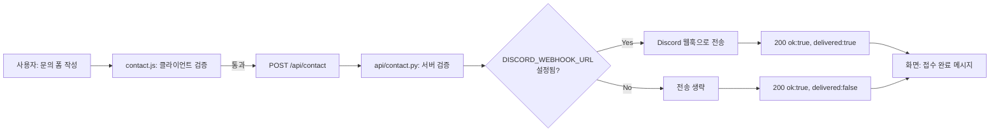

# 보너스 과제

## 보너스 1 — 운영 자동화 (문의 폼 → Discord 웹훅)

### 설계

문의하기 페이지의 제출 흐름을 "사용자 입력 → 처리 → 저장/알림"의 운영 관점으로 설계했다.

### 구현

- `js/contact.js`: 이름/이메일 형식/필수 내용 검증 후 `/api/contact`로 JSON POST.
- `api/contact.py`: 서버 측에서 동일 항목을 재검증(400 처리)한 뒤, 환경 변수
  `DISCORD_WEBHOOK_URL`이 있으면 Discord 웹훅으로 정리된 메시지를 전송한다.
- **폴백 처리**: 웹훅 URL이 없거나 전송이 실패해도 예외를 삼키고 `delivered: false`로
  응답하며, 사용자에게는 항상 "문의가 접수되었습니다" 메시지를 보여준다 — 알림 연동
  장애가 서비스 전체를 막지 않도록 하는 것이 목적이다.

### 개선 효과 측정 방법

문의 접수 수는 `js/analytics.js`가 `contact_submit` 이벤트로 브라우저에 누적 기록한다.
운영자가 Discord 채널에 도착한 알림 개수와, 브라우저 콘솔에서
`FructusAnalytics.getSummary().contact_submit` 값을 주기적으로 비교하면 "웹훅이 실제로
누락 없이 전달되고 있는지"를 간접적으로 확인할 수 있다.

---

## 보너스 2 — UX 및 측정 고도화

### 2-1. 다크 모드

- `prefers-color-scheme: dark` 미디어 쿼리로 시스템 설정을 자동 감지(`css/variables.css`).
- 우측 상단(모바일은 메뉴 내) 토글 버튼으로 수동 전환 가능(`js/theme.js`), 선택값은
  `localStorage["fructus-theme"]`에 저장.
- **FOUC 방지**: 각 HTML `<head>` 최상단에 CSS보다 먼저 실행되는 인라인 스크립트를 두어,
  저장된 테마를 첫 페인트 전에 `<html data-theme>`에 반영한다.

### 2-2. 마이크로 인터랙션

| 요소 | 구현 |
|---|---|
| 결과 숫자 카운트업 | `requestAnimationFrame` + easeOutCubic으로 0→결과값 애니메이션 (`js/ui.js`) |
| 그래프 드로잉 | `getTotalLength()` + `stroke-dashoffset` 전환으로 선이 그려지는 효과 (`js/chart.js`) |
| 버튼 상태 전환 | hover/active/disabled/loading(스피너) 상태를 CSS로 구분 |
| FAQ 아코디언 | `grid-template-rows: 0fr → 1fr` 트랜지션으로 부드러운 개폐 |
| 폼 포커스 피드백 | 입력창 포커스 시 테두리 색 + 연한 그림자로 강조 |
| 로딩 스켈레톤 | AI 코치 응답 대기 중 shimmer 애니메이션 카드 표시 |
| 모션 최소화 | `prefers-reduced-motion: reduce` 시 모든 transition/animation을 사실상 제거 (`css/animations.css`) |

### 2-3. 방문자 분석

- **Vercel Web Analytics**: 모든 페이지에 `<script defer src="/_vercel/insights/script.js">`를
  삽입해 두었다(같은 오리진 경로이므로 "외부 CDN 0개" 원칙에 위배되지 않는 유일한 예외).
  Vercel 대시보드에서 페이지뷰·방문자 추이를 확인할 수 있다.
- **자체 기능 사용 카운터**(`js/analytics.js`): 서버 없이 `localStorage`에 아래 3개 이벤트를
  누적 기록한다.
  - `calculate` — 복리 계산 실행 수
  - `ai_coach` — AI 투자 코치 사용 수
  - `contact_submit` — 문의 제출 수

  브라우저 콘솔에서 `FructusAnalytics.getSummary()`를 호출하면 현재 값을 즉시 확인할 수 있다.

### 가설 – 지표 – 측정 방법

| 가설 | 지표 | 측정 방법 |
|---|---|---|
| 결과 카드에 카운트업 애니메이션을 넣으면 사용자가 결과를 더 오래 주시하고 페이지 체류시간이 늘어날 것이다 | 계산기 섹션 체류시간, `calculate` 이벤트 대비 `ai_coach` 이벤트 전환율 | Vercel Web Analytics의 페이지 체류시간 + `FructusAnalytics.getSummary()`의 `calculate` 대비 `ai_coach` 비율 비교 |
| 다크 모드를 지원하면 야간 방문자의 이탈이 줄어들 것이다 | 다크 모드 토글 사용 비율, 시간대별 방문자 수 | `localStorage["fructus-theme"]` 저장 여부를 표본 조사(수동) + Vercel Analytics의 시간대별 트래픽 |
| 문의 폼의 실시간 검증(인라인 오류)이 폼 완료율을 높일 것이다 | 폼 진입 대비 `contact_submit` 완료율 | Vercel Analytics 페이지뷰(문의 페이지) 대비 `FructusAnalytics.getSummary().contact_submit` 비율 |
| AI 코치 실패 처리(재시도 버튼)가 있으면 오류 후에도 재시도로 이어지는 비율이 높아질 것이다 | 오류 표시 후 재시도 클릭률 | 코드 계측(추가 예정): `data-ai-retry` 클릭을 별도 analytics 이벤트로 확장 가능 — 현재는 코드 구조상 확장 지점만 마련된 상태 |

마지막 행은 "현재 측정 인프라로 무엇을 더 계측할 수 있는가"를 보여주기 위해 의도적으로
미완성 상태로 남겨두었다 — `analytics.js`의 `EVENTS` 배열에 이벤트 이름만 추가하면
바로 확장 가능한 구조다.
