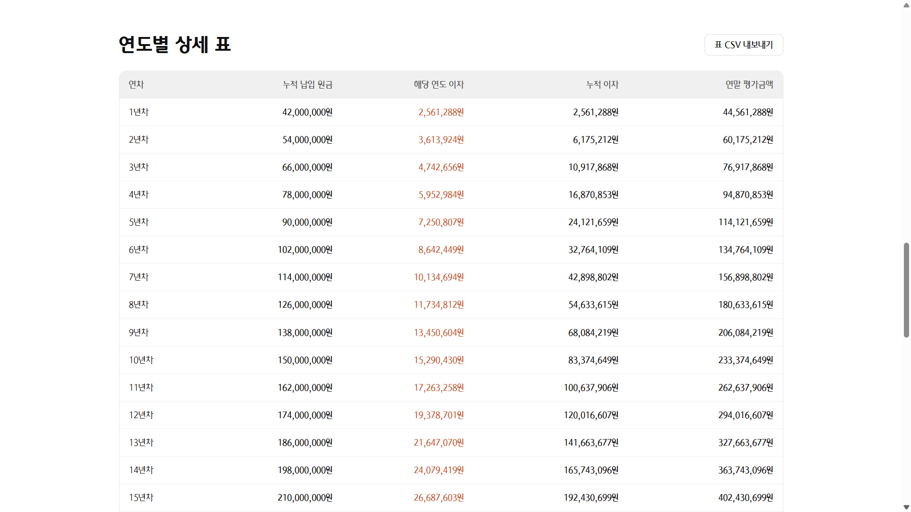
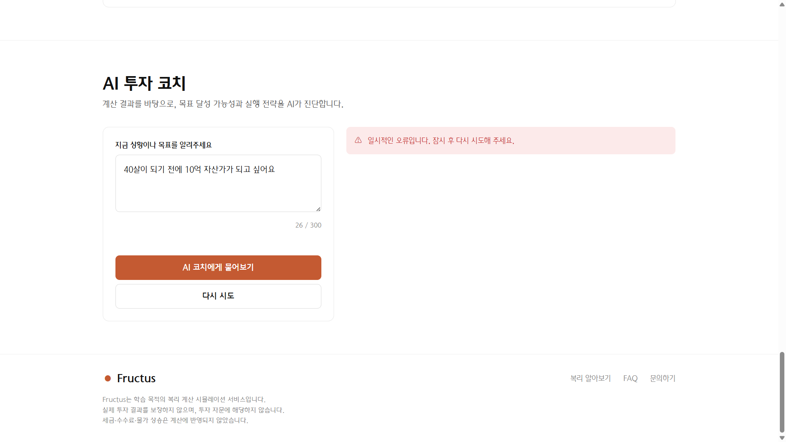
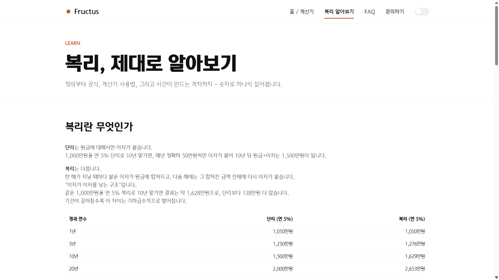
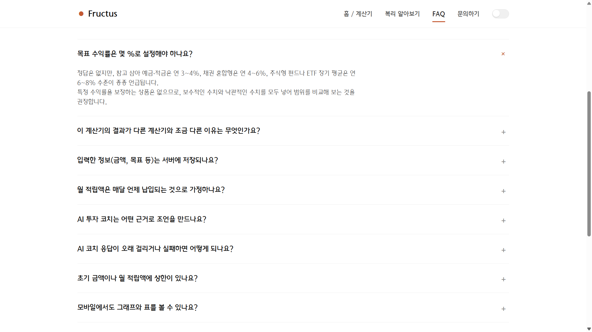
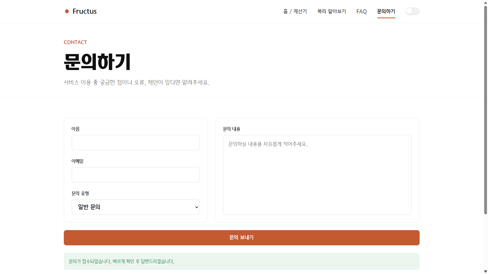
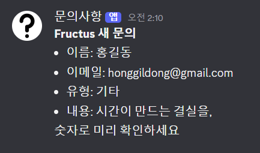

# 증빙 스크린샷

배포 URL <https://codyssey-a1-3-alpha.vercel.app/> 에서 직접 촬영한 실제 동작 화면이다.

| 구분 | 파일 | 내용 |
|---|---|---|
| 데스크톱 | `01`~`06`, `11`~`13` | 홈·계산 결과·그래프·표·AI 코치(성공/실패)·학습·FAQ·문의 |
| 모바일 | `07`~`10` | 홈·햄버거 메뉴·계산 결과·AI 코치 |
| 보너스 | `14`, `15` | Discord 웹훅 수신, 다크 모드 |

---

## 1. 데스크톱

### 1-1. 홈 화면
Hero 영역과 복리 계산기 진입부. 상단 네비게이션(홈/복리 알아보기/FAQ/문의하기)과 다크 모드 토글이 보인다.

### 1-2. 복리 계산 결과
좌측 입력 폼(초기금액·월적립액·기간+단위·목표수익률 슬라이더·복리주기)과 우측 결과 영역. 최종 평가금액을 강조하고 총 납입 원금·총 수익률·총 수익을 함께 표시하며, 원금 대 수익 구성 비율을 막대로 시각화한다.

### 1-3. 연도별 성장 그래프
외부 차트 라이브러리 없이 순수 SVG로 직접 그린 영역 차트. 누적 원금(회색)과 이자를 포함한
평가금액(오렌지)의 격차가 시간이 지날수록 벌어지는 복리 효과를 보여준다.

### 1-4. 연도별 상세 표
연차별 누적 납입 원금·해당 연도 이자·누적 이자·연말 평가금액. CSV 내보내기 버튼 포함.

### 1-5. AI 투자 코치 — 정상 응답 ★
목표를 입력하면 Gemini API가 목표 달성 가능성 진단, 부족분 해석, 실행 가능한 조언 3가지, 주의사항을 구조화된 카드로 반환한다. **AI 기능의 입력 → 결과 출력 증빙.**

### 1-6. AI 투자 코치 — 실패 처리
API 오류 상황에서 사용자에게 안내 메시지와 "다시 시도" 버튼을 노출한다.

### 1-7. 복리 알아보기
단리와 복리의 차이를 예시 숫자와 비교표로 설명한다.

### 1-8. FAQ
아코디언 UI로 13개 문항을 제공하며, 클릭 시 답변이 펼쳐진다.

### 1-9. 문의하기
좌측 이름·이메일·문의 유형, 우측 문의 내용 2단 구성. 제출 후 접수 완료 메시지가 표시된다.

---

## 2. 모바일 반응형

### 2-1. 홈 화면
네비게이션이 햄버거 메뉴로 전환되고 Hero·버튼이 세로로 쌓인다.

### 2-2. 햄버거 메뉴
메뉴를 펼친 상태. 전체 네비게이션과 다크 모드 토글이 노출된다.

### 2-3. 계산 결과
결과 지표가 세로로 재배치되어 좁은 화면에서도 잘리지 않는다.

### 2-4. AI 투자 코치
입력창과 응답 카드가 세로로 배치된다.

---

## 3. 보너스 기능

### 3-1. 문의 → Discord 웹훅 수신 ★
문의 폼 제출이 `api/contact.py`를 거쳐 Discord 채널로 실제 전달된 화면. **"사용자 입력 → 처리 → 알림" 운영 자동화 증빙.**

### 3-2. 다크 모드
CSS 변수 기반 다크 팔레트가 적용된 화면. 시스템 설정 자동 감지 + 수동 토글을 지원한다.

---

## AI 코딩 도구 사용 증빙

AI 코딩 도구(Claude Code) 사용 과정은 [AI_USAGE_LOG.md](AI_USAGE_LOG.md)에 단계별 프롬프트 요약과
실제로 발생한 오류 7건의 원인 분석·수정 기록으로 정리되어 있다.
